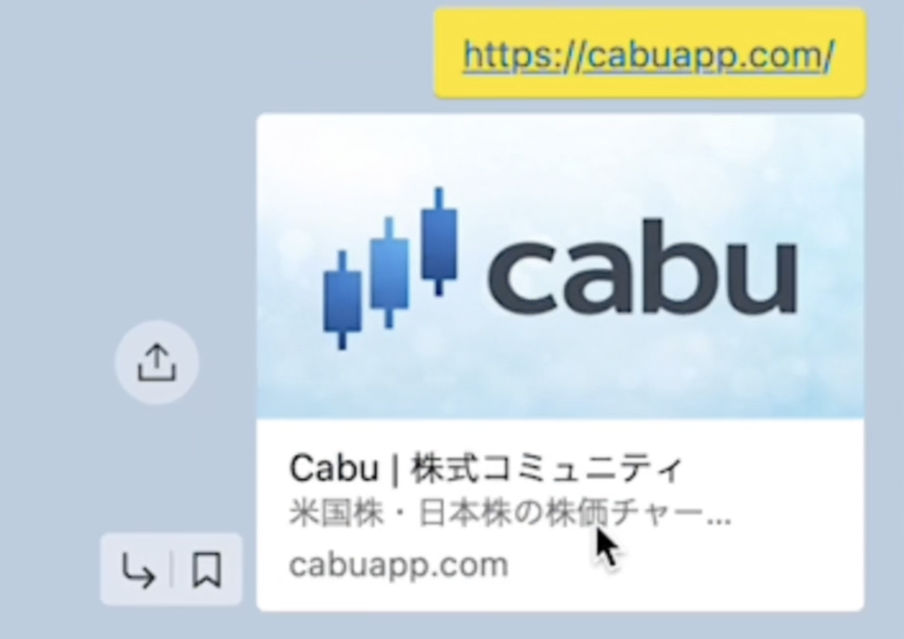
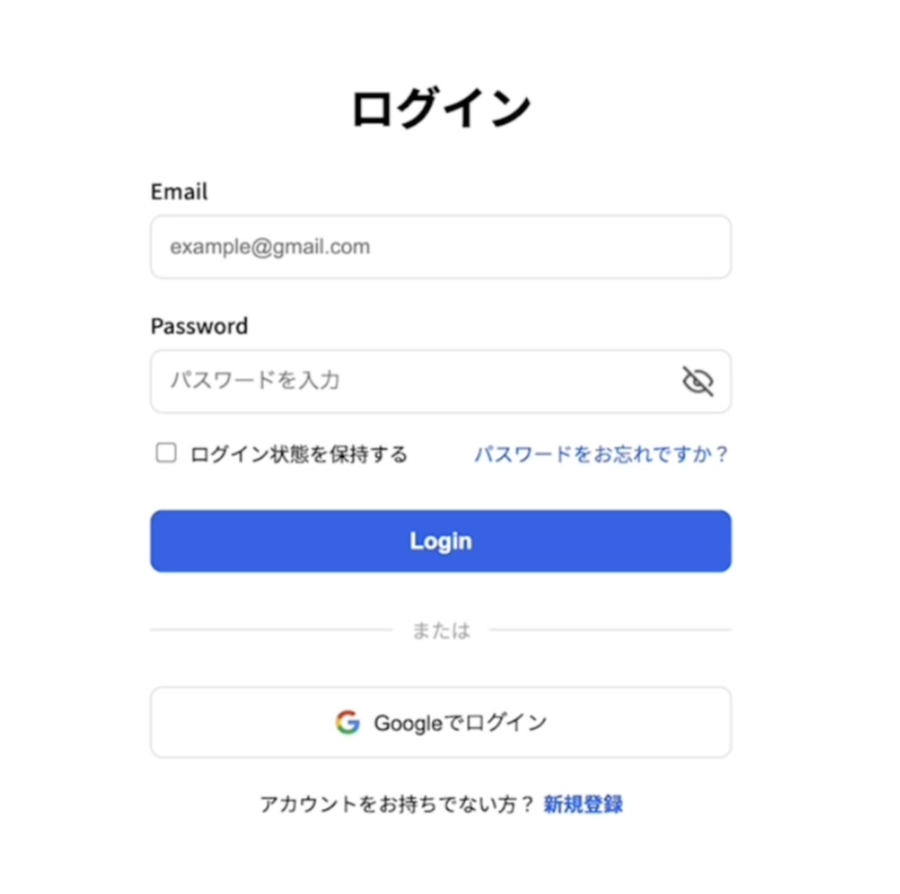
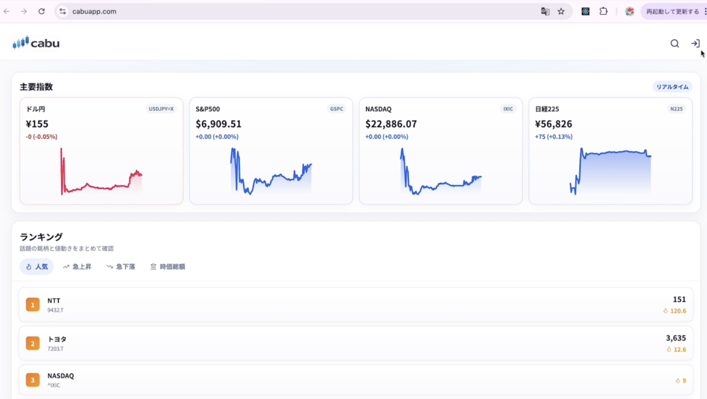
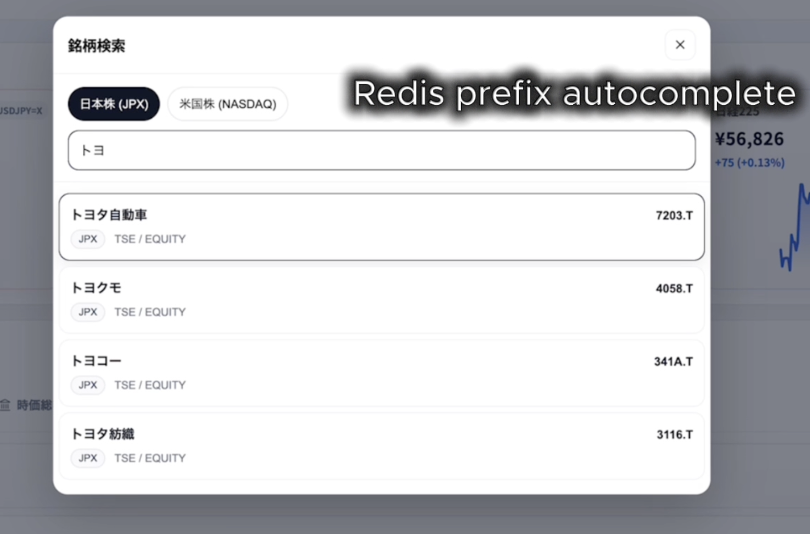
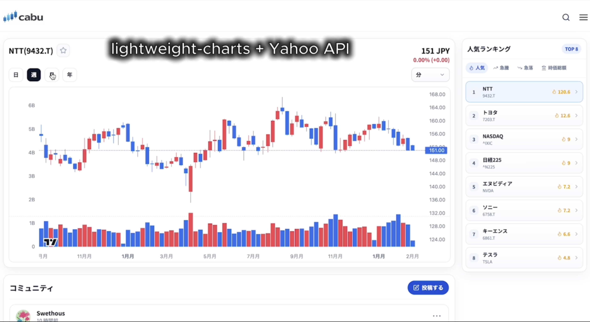
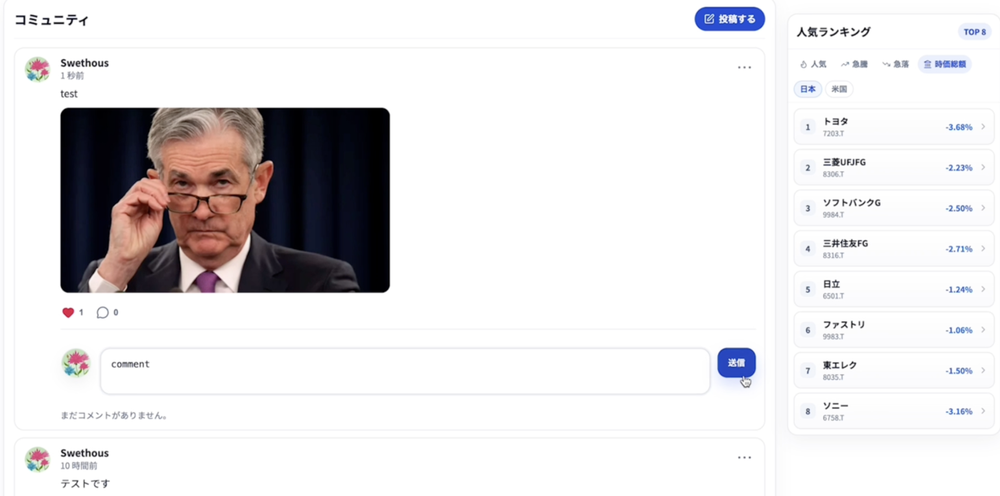
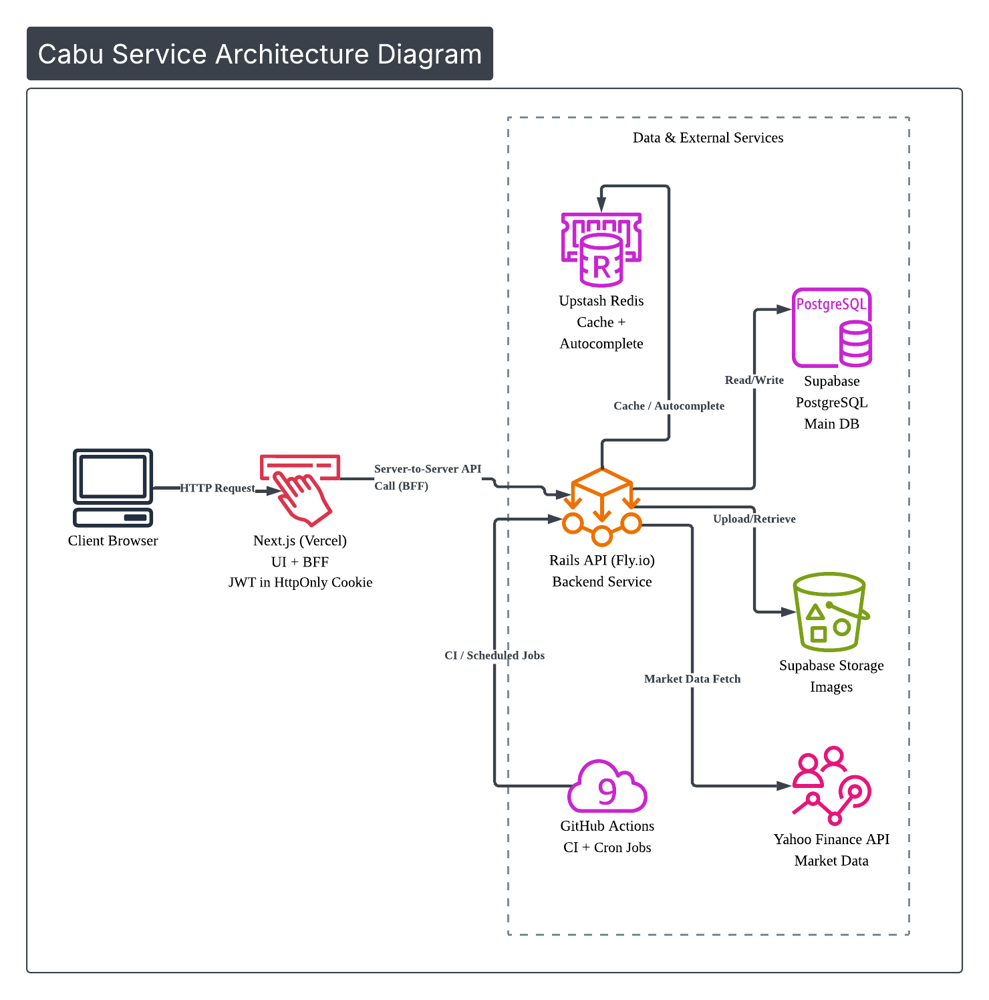
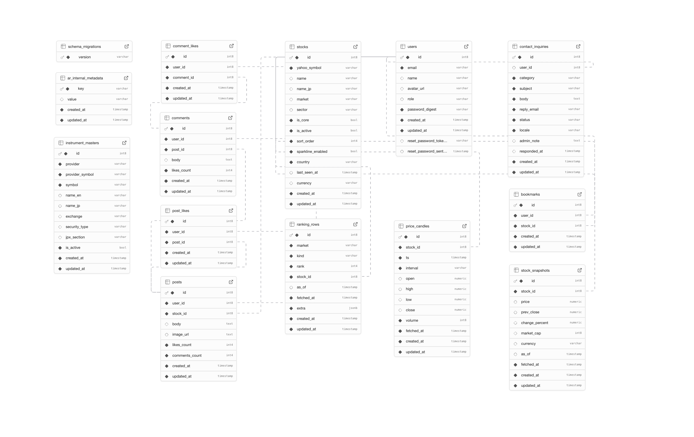

# Cabu

> **미국주/일본주 종목별 커뮤니티 + 차트**를 한 화면에서 제공하는 경량 주식 커뮤니티 서비스  
> **정보(차트/거래량) 확인 → 의견(댓글) 확인/작성**을 빠르게 이어갈 수 있도록 UX를 설계했습니다.

## Links
- 서비스: https://cabuapp.com
- Figma(화면 설계): https://www.figma.com/design/VuqGq0HjgLSpIcxZkyb3Nn/stock_community_mobile?node-id=0-1&p=f&t=dZ683DSGNzhnh5Lx-0

---

## Demo Video
  
- Watch: [Cabu Demo](assets/Cabu_demo.mp4)

---

## Screenshots

| SEO (Metadata/OG) | Login (JWT HttpOnly + Google) |
|---|---|
|  |  |

| Main (Rank/Trends) | Search (Redis Prefix Autocomplete) |
|---|---|
|  |  |

| Chart (lightweight + Yahoo) | Community (Post/Image/Like/Comment) |
|---|---|
|  |  |

---

## Background
한국에서는 가볍고 사용하기 쉬운 주식 커뮤니티를 자주 이용했지만,  
일본 투자 환경에서는 **차트와 커뮤니티를 한 화면에서 빠르게 확인**할 수 있는 서비스가 드물었습니다.  
초보자도 부담 없이 사용할 수 있는 **가볍고 빠른 주식 커뮤니티**를 목표로 Cabu를 만들었습니다.

---

## Key Features
- 회원가입/로그인 (**JWT + HttpOnly Cookie**, Google 로그인), 비밀번호 재설정
- 종목 검색 + **오토컴플리트(prefix 기반)**
- 종목 상세: **차트 + 거래량 + 커뮤니티(댓글)** 한 화면 제공
- 게시글/댓글 작성, 좋아요, 북마크
- 인기/급상승/급락 등 랭킹 리스트
- 문의하기

---

## Architecture

Client → Next.js(UI + BFF) → Rails API 흐름으로 요청을 처리했습니다.  
인증은 Rails에서 JWT를 발급하고, Next.js가 HttpOnly 쿠키(access_token)로 관리합니다.  
UI는 “차트 + 커뮤니티”를 한 화면에서 빠르게 탐색할 수 있도록 구성했습니다.  
Rails API는 Supabase(PostgreSQL)·Upstash Redis(autocomplete)·Supabase Storage(이미지)와 연동합니다.  
또한 Yahoo Finance API에서 시세 데이터를 가져오고, GitHub Actions로 배치 작업을 주기적으로 실행합니다.

---

## Tech Stack

### Backend
| 기술 | 버전 / 서비스 | 채택 이유 |
|---|---|---|
| Ruby | 3.3.10 | Rails 7.2와 호환성이 좋고 안정적인 최신 런타임 |
| Ruby on Rails (API) | 7.2.3 | API 중심 개발에 생산성과 유지보수성의 균형이 좋음 |
| 인증 | JWT + HttpOnly Cookie | 토큰을 HttpOnly 쿠키에 저장해 XSS 리스크를 낮추고 인증 흐름을 단순화 |
| PostgreSQL | Supabase PostgreSQL (운영) | 매니지드 PostgreSQL로 운영 부담을 줄이면서 안정적으로 데이터 저장 |
| Redis | Upstash Redis (매니지드) | prefix 기반 자동완성(autocomplete) 구현을 위해 빠른 조회 성능을 활용 |
| Faraday | 2.14 | Yahoo Finance 등 외부 API 연동을 단순하고 유연하게 구현 |

### Frontend
| 기술 | 버전 / 서비스 | 채택 이유 |
|---|---|---|
| Next.js | 16.1.1 | App Router 기반으로 SSR/SEO와 **BFF(Route Handlers)** 구성이 가능해 통신 구조를 단순화 |
| TypeScript | 5 | 타입 안정성으로 런타임 버그를 줄이고 유지보수성을 향상 |
| TanStack Query (React Query) | 5.90.16 | 서버 상태 캐싱/재요청/무한스크롤 등 데이터 패칭 관리에 최적 |
| lightweight-charts | 5.1.0 | 주가 차트를 가볍고 빠르게 렌더링 가능 |
| Supabase JS | 2.93.3 | Supabase Storage(이미지 업로드) 연동을 간단하게 구현 |
| Sonner | 2.0.7 | 토스트/알림 UI를 가볍게 구성해 UX 개선 |

### Infrastructure
| 기술 | 버전 / 서비스 | 채택 이유 |
|---|---|---|
| Fly.io | Backend Hosting | Rails API를 컨테이너로 배포/운영하기 간단하고 안정적 |
| Vercel | Frontend Hosting | Next.js와 궁합이 좋고 Git 연동 기반 자동 배포/프리뷰가 편리 |
| Supabase PostgreSQL | Managed DB | 운영 DB를 매니지드로 관리해 운영 부담 감소 |
| Upstash Redis | Managed Redis | prefix 기반 자동완성 등 빠른 조회가 필요한 기능에 활용 |
| Supabase Storage | Managed Storage | 게시글 이미지/아바타 이미지 업로드 및 제공을 단순화 |
| Docker Compose | `infra/docker/compose.yml` | 로컬 개발 환경을 통일해 재현성과 온보딩을 개선 |

### Dev Environment · CI/CD
| 기술 | 버전 / 서비스 | 채택 이유 |
|---|---|---|
| Ruby | 3.3.10 | Rails 실행 환경을 안정적으로 고정 |
| Node.js | 20.19.2 | Next.js 실행 환경을 통일 |
| GitHub Actions | CI/CD | 품질 체크와 배포를 자동화해 운영 효율을 높임 |
| CI (Backend) | Brakeman / RuboCop / Rails test | 보안 점검·코드 품질·회귀 테스트를 자동 수행 |
| CD (Backend) | Fly Deploy Workflow | `main` + `backend/**` 변경 시 백엔드 자동 배포 |
| CD (Frontend) | Vercel Git Integration | 브랜치별 Preview 제공, `main`은 Production 자동 반영 |
| Scheduled Workflows | Rankings / Popular / Sparklines | 정기 배치(랭킹/인기/스파크라인 갱신)를 GitHub Actions 크론으로 실행 |

---

## Problem Solving · Technical Highlights

- **종목 메타데이터(i18n) 해결: JPX 엑셀 + 오버라이드**
  - Yahoo Finance만으로는 일본어 종목명이 부족해, **JPX 공식 엑셀을 수집/파싱**해 일본 종목 마스터를 구축했습니다.
  - 미국 종목은 **주요 종목 일본어 오버라이드 파일**로 보완해 검색/상세에서 일관된 표기를 제공했습니다.

- **React → Next.js 마이그레이션(캐시 공유 + SEO)**
  - **revalidate 기반 캐시**로 사용자 간 캐시를 공유해 외부 API 호출을 줄이고, 로딩 체감을 개선했습니다.

- **BFF(Route Handlers)로 보안·CORS·통신 단순화**
  - 브라우저 요청을 Next로 통일하고 Rails는 서버-서버로 호출해 **CORS 없이** 구조를 단순화했습니다.
  - **JWT + HttpOnly Cookie**로 토큰을 JS에서 직접 다루지 않도록 했습니다.

- **Upstash Redis Prefix Autocomplete**
  - prefix 기반 자동완성 조회를 Redis로 처리해 검색 응답 속도를 개선했습니다.

- **차트 최적화: Backend Cache + Front Revalidate**
  - Yahoo Finance 데이터는 백엔드 캐시 + 프론트 재검증으로 **호출 최소화와 최신성**을 균형 있게 유지했습니다.

- **Sidekiq → GitHub Actions 배치 전환(비용/운영)**
  - 워커 상시 구동이 필요 없는 작업은 **Actions Cron**으로 전환해 비용을 줄이고 운영을 단순화했습니다.

- **React Query로 UX 개선(Infinite + Optimistic)**
  - 서버 상태를 캐시 기반으로 관리하고, **Infinite Query**와 **Optimistic Update**로 탐색/반응성을 개선했습니다.

---

## Future Improvements
- 뉴스 API 연동 + AI 요약
- 게시글 투표 기능
- 이용약관 / 개인정보처리방침

---

## ERD

---

## License
본 프로젝트는 개인 포트폴리오 및 학습 목적으로 제작되었습니다.